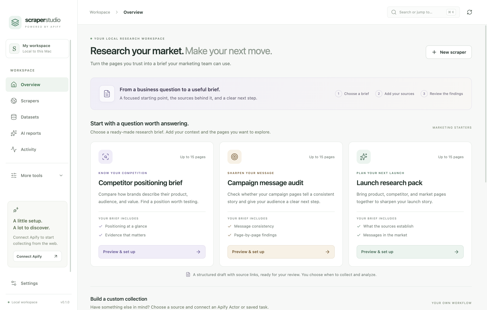
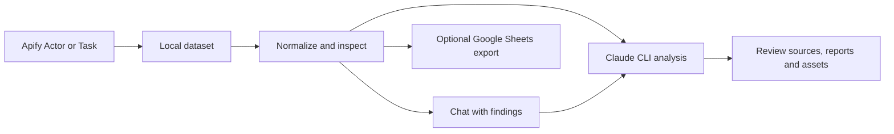

<div align="center">

# Apify Scraper Studio

**Research your market. Review the evidence. Make your next move.**

A research and content workspace with General and Semrush editions, a macOS desktop app, and a portable browser runtime.

[Get started](#get-started) · [Features](#what-you-can-do) · [Development](#development)


</div>

Scraping is the first step. The useful work starts when you can compare results, trace a claim to its source, and turn a dataset into a report worth reviewing. Scraper Studio brings that workflow into one desktop app, with local files and a record of what ran.

> **Early public version (0.1.0).** Includes application code, tests, and macOS packaging configuration. The interface uses your real workspace data, with guided setup and advanced tools available on demand. Live service workflows require your own account configuration. This is an independent project, not an official Apify, Anthropic, or OpenAI product. The hero is AI-generated artwork, not an application screenshot.

## Research and Content Studio

Research programs reproduce the n8n “Golden Thread” workflow: X, LinkedIn and Reddit collected in parallel with the n8n Actor inputs, 200-post discovery batches per platform, six synthesized themes matched against your tracked themes, n8n trend velocity and priority tiers (FAST-TRACK to LOW) from your Taxonomy Lookup, every post tagged, and a comprehensive trends report plus a dual-angle editorial toolkit per theme. Load the taxonomy, product registry and ICP/positioning documents in **Brand knowledge → Research knowledge**. See the [parity notes](docs/n8n-parity.md).

The default starting screen now has two paths: **Research your market** and **Create from a trend**. Save bulk source programs, review discovered themes, classify every eligible batch, and create paired reports. Or import a brief and choose from twelve written channel families, the report pair, and configured image formats. General and Semrush workspaces keep separate program, knowledge and asset histories.

See the [complete guide and distribution estimates](docs/content-studio-guide.md), [implementation contract](docs/PRD-content-studio.md), and [product research](docs/RESEARCH-content-studio.md). The image provider is awaiting credential setup; Google OAuth tokens require manual reconnection. The browser build is for a private single-team pilot, not a finished multi-tenant SaaS.

```sh
npm run build:web
# Set STUDIO_PASSWORD securely in your environment before starting.
npm run start:web
```

Windows packaging is configured with `npm run dist:win`; native Windows release testing remains outstanding.

## What you can do

| Workflow | Inside the app |
| --- | --- |
| Search platforms | Choose a topic or specific targets, set subreddit/account/date/comment filters, and review the exact collection plan before running. |
| Collect | Save custom Apify Actor or Task recipes, run scrapers, and inspect run history. |
| Sheets | Review every research run as a Golden Thread workbook (Theme Repository, Twitter, Reddit, LinkedIn, Theme Summary Data, Trend Velocity and more) with spreadsheet selection, sorting, filters, find, totals, edits and copy-to-Google-Sheets. Import .xlsx/.csv or pull a Google Sheet to review alongside. See the [Sheets guide](docs/sheets-guide.md). |
| Explore | Normalize results, choose columns, save filters, compare raw and normalized rows, and search evidence across runs. |
| Chat with findings | Ask questions across up to eight datasets, inspect validated source references, and revisit saved conversations. |
| Analyze | Use Claude Opus 5.5 through your installed Claude CLI for tags, threads, reports, and asset drafts. Codex CLI remains an explicit optional provider. |
| Review | Edit generated assets, inspect local evidence scores, review or approve outputs, and open their files. |
| Coordinate | Use Mission Command for action and evidence graphs, durable jobs, watch loops, and mission bundle exports. |
| Export | Send normalized rows to Google Sheets through an optional Apps Script bridge with local operation receipts. |

Search platforms has four guided Actor integrations. Its [source controls guide](docs/research/source-options-2026-09-27.md) documents each Actor’s filters and date semantics; unsupported cross-platform options are not offered. Refresh Apify catalog shows Actors available in your account history; the development account returned nine in the recorded check. Catalog discovery does not make every Actor a guided source or guarantee its access. Custom recipes still accept other Actors or saved Tasks, including general websites. See the [integration setup guide](docs/integration-setup.md) for the exact Actors and collection differences.

## Marketing playbooks

**Playbooks** now offers eight guided outcomes: competitor positioning, campaign message audit, launch research, account research, voice of customer, content opportunities, advertising messages, and weekly competitor changes. Each card explains the evidence required and what the brief can establish.

Save your offering, audience, positioning, competitors, ICP, voice, and claims to avoid in **Brand context**. Apply that profile to a collection; reports keep a snapshot so later profile edits do not rewrite the context of older research. Account research requires explicit ICP criteria and groups collected pages by source domain.

Public-page playbooks prepare bounded Website Content Crawler recipes: up to 15 supplied URLs, a default $2 Apify cap, and a five-minute timeout. Dataset playbooks use existing collections or **Import research**: CSV, JSON, and JSONL with column mapping, preview, duplicate counts, source metadata, and an authorization acknowledgement. Imports are local; later AI analysis sends its bounded context to the selected provider. Search-result imports preserve supplied queries, ranks and locale, and flatten nested organic results. Ad research uses supplied text and cannot inspect unseen media or infer performance.

**Compare snapshots** matches source URLs, ignores known tracking parameters and whitespace-only differences, and shows dated before/after excerpts. A missing page is marked unavailable rather than removed. A comparison can become a dataset for a change brief. Saved daily/weekly check-ins are local due reminders; you start collection yourself.

## Review a decision before sharing it

Reports start as **Draft**. Their review panel shows requested versus retrieved pages, usable and duplicate records, the exact analysis sample, shortened text, source dates, and collection/AI receipts. Inspect the source register beside the report, record notes, and assign actions with owners, due dates, progress, and evidence references. Classify proposed actions as observations, inferences, or open questions.

Approval requires a named local reviewer, completed evidence checks, acknowledgement of every coverage warning, and usable recorded source evidence. Missing snapshots block approval. Changes to the report or evidence invalidate previous checks. These are local review records; they do not authenticate a teammate or implement enterprise permissions.

Export a printable HTML or Markdown review package containing the brief, evidence CSV, review record, and a receipt with source coverage, brand context, model and cost information. Draft exports are explicitly marked. The Overview shows open actions and due source check-ins from your saved work.

The [research memo](docs/research/enterprise-marketing-2026-09-27.md) explains the rationale; the [eight-playbook guide](docs/templates/enterprise-marketing-playbook-pack.md) describes inputs and limitations. Research programs support daily, weekly, and monthly schedules while the desktop app or web server is running; see the [scheduling guide](docs/content-studio-guide.md#repeat-a-research-program). Shared identity, team permissions, internal-system connectors, and managed always-on hosting remain architecture decisions for a team product.

## Inside the app



[Guided scraper builder](docs/assets/studio-scraper-builder.png) · [Dataset explorer](docs/assets/studio-datasets.png)

Screenshots show the native desktop app. The dataset explorer uses explicitly labeled QA fixtures; it is not evidence of a live scraping run.

**Ask AI** in the header (⌘J) answers questions about the app on any page. It reads [the app guide](docs/app-guide.md) plus a summary of your own setup and recent runs, never keys, tokens or collected posts, and uses your Claude connection (about $0.10 a question).

## How it works



Apify runs scraping infrastructure, proxies, and extraction. Scraper Studio manages recipes, local datasets, analysis workspaces, jobs, and outputs. Claude runs through a local CLI process using your existing sign-in. The app sends selected context through standard input with file, browser, and connector tools disabled. Codex is available when explicitly selected in Settings. Local-first describes where the app keeps its state; scraping and AI analysis still use external services.

For example, search a product category, open the collected posts, then ask which customer needs appear in that sample. Chat checks cited IDs and quoted excerpts against the supplied records and opens links from those records. A matching citation does not prove an interpretation; review the sources before using a conclusion.

## Get started

### Requirements

- macOS with Node.js 22.12+ and npm. Node.js 24 also meets the locked toolchain requirements.
- An Apify account and API token for live scraping. Actor usage may incur Apify charges.
- Claude, reached one of two ways. **Settings → Writing & research → Automatic** (the default) picks for you:
  - the [Claude app (Claude Code CLI)](https://code.claude.com/docs/en/setup), installed and signed in (`claude auth login`). It must support every print-mode flag the app passes; the check compares them with `claude --help`, so an outdated CLI is reported with "run `claude update`" instead of failing mid-run. Verified with 2.1.281.
  - an Anthropic API key (from console.anthropic.com), stored in the macOS keychain. Requests go straight to the Messages API with structured output; usage is billed to the key's account.
  - Research uses `claude-opus-5-5` and `claude-fable-5-1` by default. **Check Claude** confirms the route and each model (free through the API; a tiny request per model through the Claude app). Work that spends checks the models it needs first.
- Codex CLI is optional. Select it explicitly in Settings to use its existing configuration; Claude failures do not trigger a provider fallback.

### Run from source

```bash
git clone https://github.com/ChrisJDiMarco/apify-scraper-studio.git
cd apify-scraper-studio
npm ci
npm run dev
```

### Your first run

1. Choose **Connect Apify** from Overview and save your API token in Settings.
2. In **Your AI assistant**, check Claude and save the default `claude-opus-5-5` model and your per-request budget. The connection check confirms sign-in; a real request verifies model access.
3. Open **Search platforms**. In **Search brief**, enter a topic and select sources; a topic is optional for targeted account/community collection. In **Sources & filters**, enter subreddits, X handles, or LinkedIn profile/company URLs and choose each source’s supported dates, comments, replies, and extra details. **Review & run** validates the exact plan without service calls and shows the result allowances and per-source spending caps before you click **Search selected sources**. Draft settings stay on this Mac. The default allowance is 10 results and $0.25 per source; LinkedIn account comments/reactions have explicit extra-row limits.
4. Open a returned collection to inspect its rows, then choose **Chat with findings**. Select up to eight datasets and ask a question; expand the answer's sources and coverage details.
5. Open **Playbooks** to choose a marketing outcome, save your **Brand context**, and collect or import the required evidence. Saving a public-page playbook prepares a recipe without starting a paid run. Review the resulting brief in **AI reports**, assign actions, and export it with its evidence. **New scraper** supports custom Actor or Task inputs.

Press **⌘K** (or **Ctrl+K**) to search pages and actions. Arrow keys select a result, Enter opens it, and Escape returns focus to your previous control.

## Share a setup with your team

**Settings → Share your setup → Export setup…** writes one JSON file with the workspace's brand knowledge, approved products, taxonomy, reference documents and research programs. It leaves out runs, collected data and reports. A teammate chooses **Import setup…**, reviews what will change, and imports it in one step. Imported schedules arrive paused. Optionally, the file carries the Apify token for a team that shares one Apify account; anyone holding such a file can spend on that account, so share it only through internal channels. Setup files can contain internal documents: never commit them.

## Data and credentials

The app stores state, datasets, workspaces, and receipts in its Electron `userData` directory under macOS Application Support. Mission state uses an append-only event log with projected state under `v5/`; legacy `data.json` can be imported without relocating existing assets.

Saved API tokens and the Sheets webhook URL use Electron `safeStorage`. Saving a secret fails if secure storage is unavailable. Datasets, analysis files, and operational receipts are ordinary local files; treat them according to the sensitivity of the material you collect. Review Actor inputs before saving credentials or session cookies in them. Field-name-based redaction cannot guarantee removal of secrets embedded in free text or URLs.

## Optional Google Sheets bridge

The starter [Apps Script webhook](scripts/google-sheets-webhook.gs) keeps Google authorization in Apps Script. It has no built-in request authentication or spreadsheet allowlist. Add appropriate access controls before using it with real data; do not expose it as an anonymous endpoint running with your Google permissions.

Once secured and deployed as a web app, configure its URL, working spreadsheet URL, archive folder ID, and platform tab names in Settings. Redeploy the script after updating it; the new actions need the Drive scope (run `authorizeBridge` once in the Apps Script editor).

| Action | Behavior |
| --- | --- |
| `ping` | Check the webhook and spreadsheet connection. |
| `readTabs` | Read rows from named tabs, or every tab in workbook order with `allTabs` (used by Sheets → Pull from a Google Sheets link). |
| `writeDatasetRows` | Write normalized rows in chunks with request IDs for deduplication. |
| `archiveAndClear` | Copy the working spreadsheet to the archive folder, then clear configured tabs. |
| `createSpreadsheet` / `appendRows` | Create a Google Sheet from a local workbook (Sheets → Export → Create Google Sheet), writing large tabs in chunks. |
| `createDoc` / `createFile` | Publish trend reports and toolkits as Google Docs (and images as files) into the configured Drive folders, without a pasted access token. |

Each operation writes a local receipt and request/response snapshot under `sheets/`. Transient failures are retried; failed operations can be replayed from Settings. Chunked-write idempotency depends on the webhook honoring `requestId`. Archive-and-clear changes the live spreadsheet, so check the configured destination first.

## Development

September 27 verification: **441 tests and 14 native search workflow checks pass**, and the final production build completes. The [source-controls verification](docs/verification/2026-09-27-source-controls.md) records the full regression results, normal/compact screenshots, and provider limitations. The preceding dependency audit reported zero vulnerabilities; this source-controls pass adds no dependencies. The Vitest suite includes offline main-process integration tests with mocked Apify and CLI processes. They exercise bounded collection, partial failures, chat persistence and retries, citation filtering, exact-model receipts, and Claude routing for reports and assets without service calls or charges. Native desktop smoke tests use disposable fixtures for setup, navigation, datasets, and exports. The [research upgrade verification](docs/verification/2026-09-27-research-upgrades.md) records 11 additional native workflow/layout checks and screenshots.

A separate [September 27 service receipt](docs/verification/service-smoke-2026-09-27T19-18-27-624Z.json) records real X, LinkedIn keyword-search, and LinkedIn profile collections: two posts from each. Claude Opus 5.5 then answered across those six records with six validated references and generated a report from the X sample. The receipt confirms the actual model. Reddit requires a minimum request of 10; after that validation was added, the [isolated retry](docs/verification/service-smoke-2026-09-27T19-25-32-664Z.json) succeeded with seven posts and Apify-reported usage of $0.0616 under its $0.25 cap. Native UI checks review the saved results without repeating paid requests.

These results verify a small sample on one configured account. They do not establish complete platform coverage, invoice accuracy, every report format, or live Google Sheets behavior.

| Command | Purpose |
| --- | --- |
| `npm run dev` | Start Electron with the Vite development workflow. |
| `npm test` | Run the Vitest suite. |
| `npm run test:desktop` | Native first-run smoke test after building; creates disposable data and screenshots. |
| `npm run test:desktop -- --with-data` | Native dataset, CSV export, report, and compact-window checks using clearly marked fixtures. |
| `npx electron scripts/service-smoke.cjs --review` | Inspect saved-workspace screens and capture normal/compact layouts; starts no Apify or AI runs. |
| `npx electron scripts/service-smoke.cjs --live` | Manual paid end-to-end check using the app's saved account configuration; see [limits and effects](docs/integration-setup.md#verification). Never part of `npm test`. |
| `npx electron scripts/research-upgrades-smoke.cjs` | Verify playbooks, brand context, import, comparison, report review, and export in a disposable workspace; provider calls are blocked. |
| `npx electron scripts/search-options-smoke.cjs` | After building, verify all four source editors, exact preview/run agreement, saved drafts, comment evidence, and compact layouts with a fixture client; provider calls are blocked. |
| `npm run test:coverage` | Generate a local coverage report. |
| `npm run build` | Build the main process, preload, and renderer. |
| `npm run preview` | Build and launch the app. |
| `npm run pack` | Build an unpacked macOS app. |
| `npm run dist` | Build DMG targets for Apple Silicon and Intel in `dist/`. |
| `npm run release:diagnostics` | Inspect release configuration and readiness checks. |

```text
src/main/        Electron lifecycle, IPC, storage, service orchestration
src/preload/     Renderer-to-main bridge
src/renderer/    React views and styles
src/shared/      Recipes, datasets, jobs, validation, analysis, mission state
scripts/         Build helpers, notarization, diagnostics, Sheets webhook
test/            Core, mission-state, and renderer tests
resources/       App icons and macOS entitlements
```

### Packaging status

`npm run dist:mac` builds a universal app (Apple silicon and Intel). Packaging configuration is included; a public repository does not imply a signed or notarized release. The notarization hook runs only when `APPLE_ID`, `APPLE_APP_SPECIFIC_PASSWORD`, and `APPLE_TEAM_ID` are configured. Automatic updates are disabled by default and require an `APIFY_STUDIO_AUTO_UPDATE_URL` feed. Use the diagnostics command before distributing a build.

Live Apify and AI requests require your own account configuration. Recheck the integrations you will use; Google Sheets and optional Codex need separate live verification. The [production-readiness plan](PRODUCTION_READINESS_PRD.md) records intended hardening work, not a certification that every item is complete.

## Feedback and licensing

Found a bug or have a focused workflow idea? [Open an issue](https://github.com/ChrisJDiMarco/apify-scraper-studio/issues) with reproduction steps, macOS version, and redacted logs. Never include API tokens or private datasets.

The code is publicly viewable. It retains the existing `UNLICENSED` designation; no open-source license is granted by this publication.
