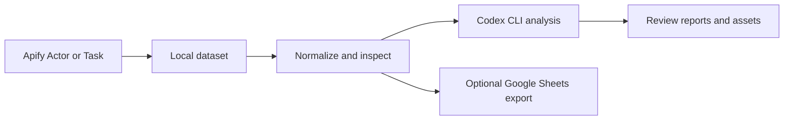

<div align="center">

# Apify Scraper Studio

**Run scrapers. Inspect the evidence. Turn it into something useful.**

A local-first macOS workspace for Apify Actors, structured datasets, and Codex-assisted analysis.

[Get started](#get-started) · [Features](#what-you-can-do) · [Development](#development)


</div>

Scraping is the first step. The useful work starts when you can compare results, trace a claim to its source, and turn a dataset into a report worth reviewing. Scraper Studio brings that workflow into one desktop app, with local files and a record of what ran.

> **Early public version (0.1.0).** Includes application code, tests, and macOS packaging configuration. Some discovery and update features remain scaffolds, and some views include illustrative seed data. This is an independent project, not an official Apify or OpenAI product. The hero is AI-generated artwork, not an application screenshot.

## What you can do

| Workflow | Inside the app |
| --- | --- |
| Collect | Save recipes using an Apify Actor or Task ID, configure inputs, run scrapers, and inspect run history. |
| Explore | Normalize results, choose columns, save filters, compare raw and normalized rows, and search evidence across runs. |
| Analyze | Use your installed Codex CLI to tag datasets and draft threads, reports, and other assets. |
| Review | Edit generated assets, inspect local evidence scores, review or approve outputs, and open their files. |
| Coordinate | Use Mission Command for action and evidence graphs, durable jobs, watch loops, and mission bundle exports. |
| Export | Send normalized rows to Google Sheets through an optional Apps Script bridge with local operation receipts. |

Recipe templates cover Reddit, X, LinkedIn, and general websites. You supply the appropriate Actor or saved Task and any access it requires; templates are starting points, not bundled scraping services.

## How it works



Apify runs scraping infrastructure, proxies, and extraction. Scraper Studio manages recipes, local datasets, analysis workspaces, jobs, and outputs. Codex runs through a local CLI process and can send analysis context to its configured service. Local-first describes where the app keeps its state; scraping and AI analysis still use external services.

For example, create a subreddit-pulse recipe, collect a small sample, inspect the text and source URLs, then ask Codex for recurring pain points and supporting evidence. Review the result before using it in a report or publishing it elsewhere.

## Get started

### Requirements

- macOS with Node.js 22.12+ and npm. Node.js 24 also meets the locked toolchain requirements.
- An Apify account and API token for live scraping. Actor usage may incur Apify charges.
- Codex CLI installed, authenticated, and available on your `PATH` for AI analysis.

### Run from source

```bash
git clone https://github.com/ChrisJDiMarco/apify-scraper-studio.git
cd apify-scraper-studio
npm ci
npm run dev
```

### Your first run

1. Open **Settings** and save your `APIFY_API_TOKEN`.
2. Use **Check Codex CLI** to confirm the app can find Codex.
3. Create a recipe with an Apify Actor ID or saved Task ID. Match its input fields to that Actor's schema.
4. Start with a small run and inspect the resulting dataset and field mapping.
5. Run an analysis, then review the generated report or asset alongside its source evidence.

## Data and credentials

The app stores state, datasets, workspaces, and receipts in its Electron `userData` directory under macOS Application Support. Mission state uses an append-only event log with projected state under `v5/`; legacy `data.json` can be imported without relocating existing assets.

Saved API tokens and the Sheets webhook URL use Electron `safeStorage`. Saving a secret fails if secure storage is unavailable. Datasets, analysis files, and operational receipts are ordinary local files; treat them according to the sensitivity of the material you collect. Review Actor inputs before saving credentials or session cookies in them. Field-name-based redaction cannot guarantee removal of secrets embedded in free text or URLs.

## Optional Google Sheets bridge

The starter [Apps Script webhook](scripts/google-sheets-webhook.gs) keeps Google authorization in Apps Script. It has no built-in request authentication or spreadsheet allowlist. Add appropriate access controls before using it with real data; do not expose it as an anonymous endpoint running with your Google permissions.

Once secured and deployed as a web app, configure its URL, working spreadsheet URL, archive folder ID, and platform tab names in Settings.

| Action | Behavior |
| --- | --- |
| `ping` | Check the webhook and spreadsheet connection. |
| `readTabs` | Read rows from the configured platform tabs. |
| `writeDatasetRows` | Write normalized rows in chunks with request IDs for deduplication. |
| `archiveAndClear` | Copy the working spreadsheet to the archive folder, then clear configured tabs. |

Each operation writes a local receipt and request/response snapshot under `sheets/`. Transient failures are retried; failed operations can be replayed from Settings. Chunked-write idempotency depends on the webhook honoring `requestId`. Archive-and-clear changes the live spreadsheet, so check the configured destination first.

## Development

Publication checks on September 16, 2026: all 100 tests passed and the production build completed. Dependency installation reported 15 vulnerabilities (5 moderate, 10 high); dependency remediation remains outstanding. These checks do not verify authenticated service workflows.

| Command | Purpose |
| --- | --- |
| `npm run dev` | Start Electron with the Vite development workflow. |
| `npm test` | Run the Vitest suite. |
| `npm run test:coverage` | Generate a local coverage report. |
| `npm run build` | Build the main process, preload, and renderer. |
| `npm run preview` | Build and launch the app. |
| `npm run pack` | Build an unpacked macOS app. |
| `npm run dist` | Build DMG targets for Apple Silicon and Intel in `dist/`. |
| `npm run release:diagnostics` | Inspect release configuration and readiness checks. |

```text
src/main/        Electron lifecycle, IPC, storage, service orchestration
src/preload/     Renderer-to-main bridge
src/renderer/    React views and styles
src/shared/      Recipes, datasets, jobs, validation, analysis, mission state
scripts/         Build helpers, notarization, diagnostics, Sheets webhook
test/            Core, mission-state, and renderer tests
resources/       App icons and macOS entitlements
```

### Packaging status

Packaging configuration is included; a public repository does not imply a signed or notarized release. The notarization hook runs only when `APPLE_ID`, `APPLE_APP_SPECIFIC_PASSWORD`, and `APPLE_TEAM_ID` are configured. Automatic updates are disabled by default and require an `APIFY_STUDIO_AUTO_UPDATE_URL` feed. Use the diagnostics command before distributing a build.

Live Apify runs, authenticated Codex analysis, and Google Sheets exports require your own configuration and separate end-to-end verification. The [production-readiness plan](PRODUCTION_READINESS_PRD.md) records intended hardening work, not a certification that every item is complete.

## Feedback and licensing

Found a bug or have a focused workflow idea? [Open an issue](https://github.com/ChrisJDiMarco/apify-scraper-studio/issues) with reproduction steps, macOS version, and redacted logs. Never include API tokens or private datasets.

The code is publicly viewable. It retains the existing `UNLICENSED` designation; no open-source license is granted by this publication.
